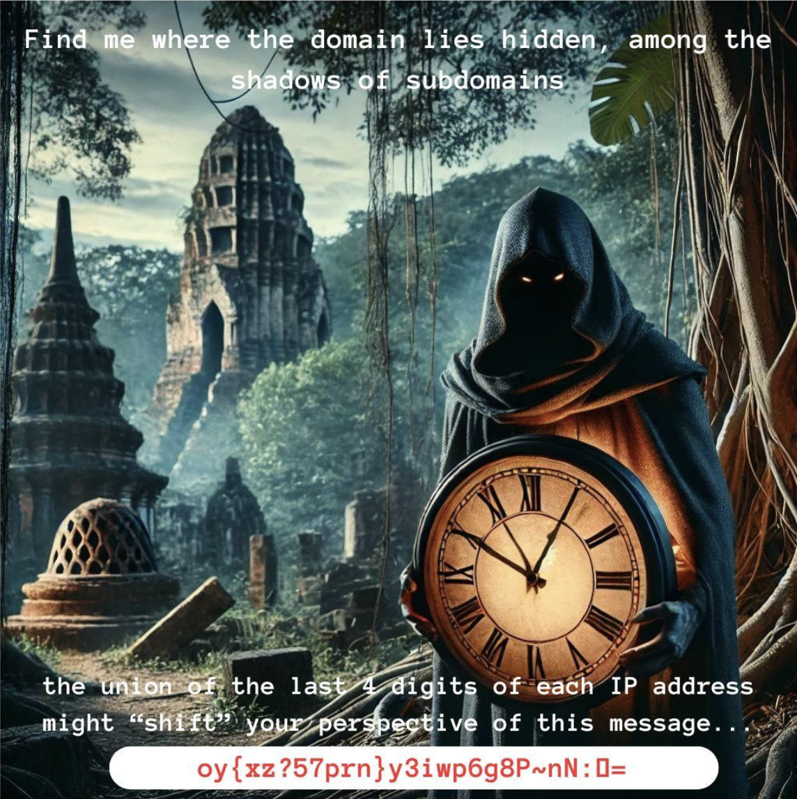
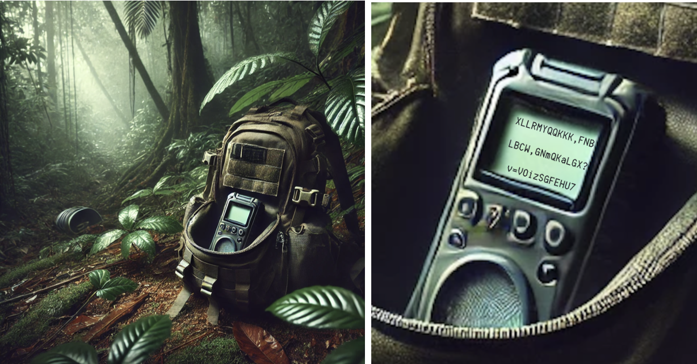
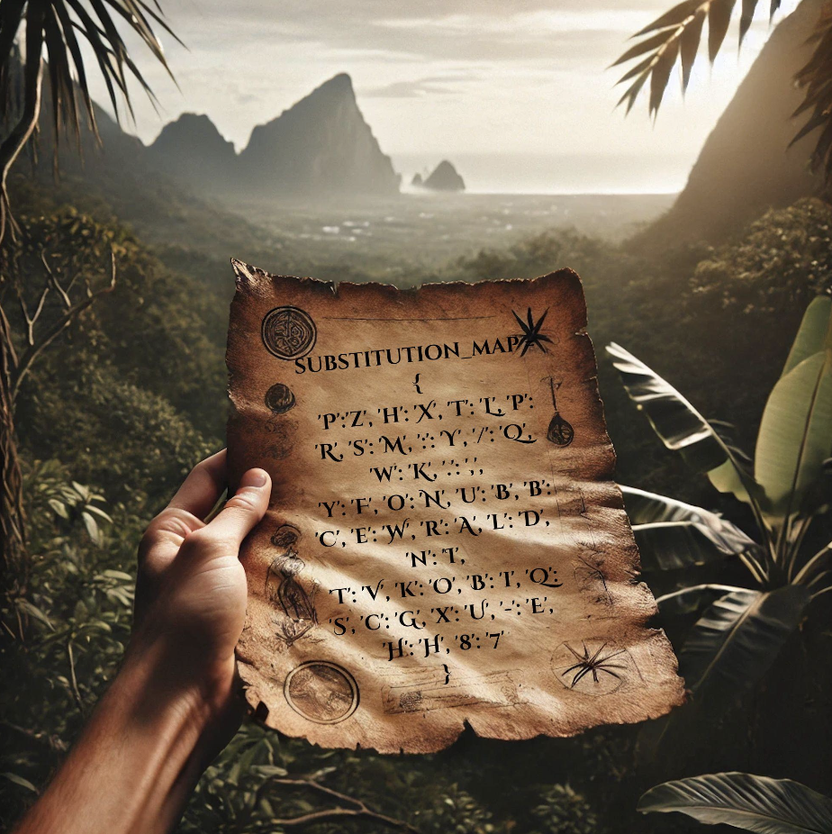
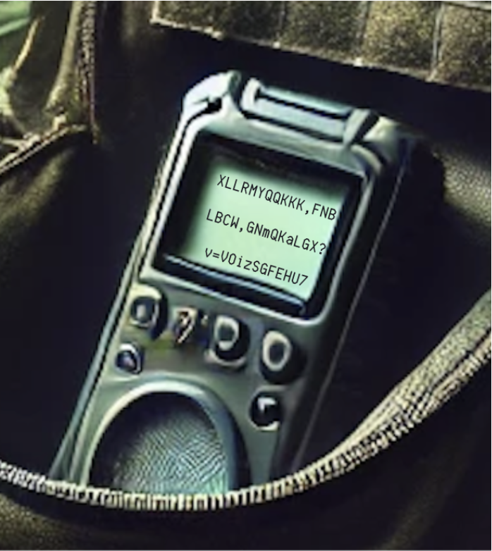
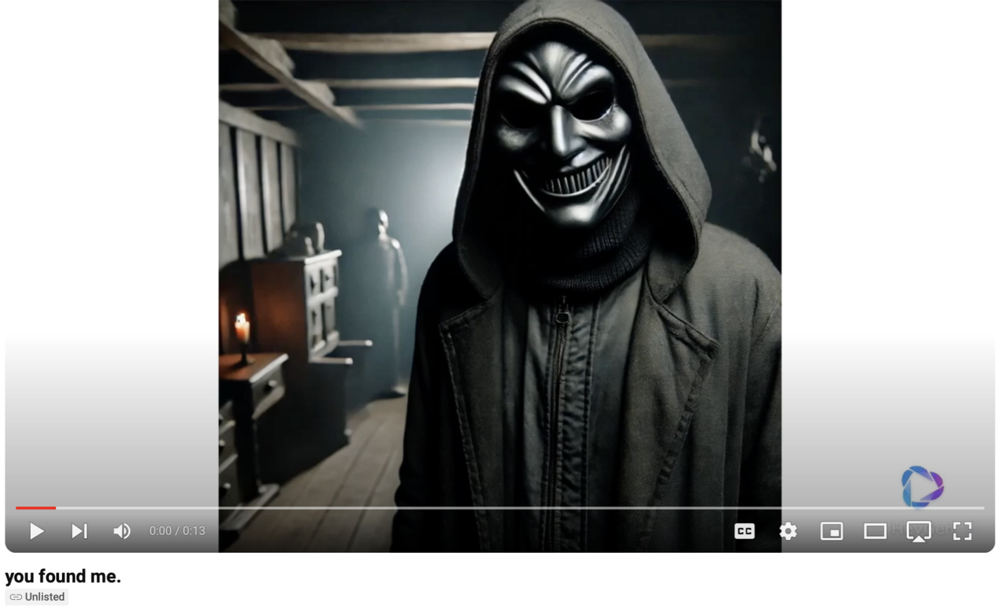

# Capture The Flag (CTF)

My final project for my **Advanced Computer Networking** class.  
This is an interactive Capture the Flag (CTF) game featuring **DNS enumeration, encryption, Python, and networking challenges**.

---

## START HERE

If you want to **play the game**, follow the instructions below (or check out [`StartHere.pdf`](StartHere.pdf)).  
If you want to see **how to solve the game**, scroll to the bottom or open [`Implementation and How to Solve (1).pdf`](Implementation%20and%20How%20to%20Solve%20(1).pdf).

---

## An Encrypted Kidnapping



You and your friends, all former IDF intelligence officers, decided to take a well-deserved trip to **Thailand** after completing your service. Among your group is Amir, known for his strategic brilliance and unmatched dedication.  

But during an excursion to a remote area, Amir goes missing under mysterious circumstances.

You eventually discover his backpack, which contains a strange device with encrypted messages and a Wireshark capture. Before you can make sense of it, a chilling message arrives from the villain:

```text
"Your friend is with me. Solve my riddles, and perhaps you'll see him again.
Your time is running out."
```

**Wireshark capture is attached in the files.**



**Message:**
```
XLLRMYQQKKK,FNBLBCW,GNmQKaLGX?v=VOizSGFEHU
```
As you and your team work frantically to crack the code, another message arrives:

```text
"Tick-tock, tick-tock. The clock is ticking. Find the secret “map” through the “traffic”
to decrypt the message, or in 24 hours, say goodbye forever."
```

It’s clear now: the **Wireshark capture holds the map** that will help decrypt this message.

The clock is ticking — it’s up to you to crack the code, uncover the hidden message, and save Amir **GOOD LUCK!**


---

# Implementation and How to Solve

## Wireshark (Network)
- Open the Wireshark capture file: [`mysterious.pcapng`](mysterious.pcapng).
- Search for keywords from the story to locate the image `thailand.jpg`.
- This image is the first clue and hints that you will need to use **DNS enumeration**.


---

## Integration with Operating System Features
Analyze the image metadata — it contains a **domain** and several **subdomains** hidden inside.
- The hidden comment was added using this command on macOS:

```bash
sudo exiftool -Comment="Domain: google.com. Secret Subdomains: amp, api, web, download, mail, ns3, support" ~/Downloads/thailand.jpg
```
- The hidden comment contains:

``` bash
Domain: google.com
Subdomains: amp, api, web, download, mail, ns3, support
```
- Players can reveal this comment by running:

``` bash
exiftool -Comment ~/Downloads/thailand.jpg
```

## DNS enumeration and Python
- Write a Python script to enumerate DNS records for the subdomains from the image and collect their **IP addresses**.  
  *(See example: [`CTF-DNSenumeration.py`](CTF-DNSenumeration.py))*

**Expected results:**

| Subdomain | IP Address     |
|----------:|----------------|
| amp       | 142.250.75.78  |
| api       | 142.250.75.68  |
| web       | 142.250.75.78  |
| download  | 142.250.75.68  |
| mail      | 142.251.37.69  |
| ns3       | 216.239.36.10  |
| support   | 142.251.37.78  |

> **Hint from the image:**  
> “The union of the last 4 digits of each IP address might **shift** your perspective of this message.”

- Take the **last four digits** of each IP and concatenate them into one large number: `7578756875787568376936103778`
- Use this number to **shift** characters of the image text via your hash/shift algorithm.  
  *(Reference implementation: [`CTF-hashFunction.py`](CTF-hashFunction.py) — includes the code used to **hash** the original message and an example of how to **de-hash** it.)*


## Hashing
- Implement the hash/shift algorithm (see [`CTF-hashFunction.py`](CTF-hashFunction.py)).
 If done correctly, this ciphertext:

```
oy{xz?57prn}y3iwp6g8P~nN: =
```
becomes this URL (the **map**):

```
https://imgur.com/a/MxmN7z6
```



---

### Substitution Map
Use the following substitution map revealed by the image:
```python
substitution_map = {
 'P':'z', 'h':'X', 't':'L', 'p':'R', 's':'M', ':':'Y',
 '/':'Q', 'w':'K', '.':',', 'y':'F', 'o':'N', 'u':'B',
 'b':'C', 'e':'W', 'r':'A', 'l':'D', 'n':'I', 'T':'V',
 'k':'O', 'B':'i', 'Q':'S', 'c':'G', 'x':'U', '-':'E',
 'H':'H', '8':'7'
}
```

---
### Decrypt the Device Message
- Now, use the map to write a **decryption** routine for the original device message.
> **Hint given from the start** after you recieved the device 
> "Tick-tock, tick-tock. The clock is ticking. Find the secret **“map”** through the “traffic” to **decrypt the message**, or in 24 hours, say goodbye forever."

**Message on device:**



it reads **XLLRMYQQKKK,FNBLBCW,GNmQKaLGX?v=VOizSGFEHU7**

- the code I used to encrypt the message and example code of how to decrypt the message can be found in the file [`CTF-encryption.py`](CTF-encryption.py)

 ---
## Encryption
- User will now use Substitution Encryption to decrypt the message
- Substitution encryption is a type of encryption where each character in the plaintext is replaced by another character according to a predefined substitution map. The substitution map defines how each character is substituted for another character in the alphabet or character set.
- ***Substitution Map:*** A substitution map is a one-to-one mapping between the original characters (plaintext) and the substituted characters (ciphertext)
- `“XLLRMYQQKKK,FNBLBCW,GNmQKaLGX?v=VOizSGFEHU7”` will become a link to a ***youtube video*** : `https://www.youtube.com/watch?v=TkBPQcy-Hx8`
- [▶ Watch the video here](https://www.youtube.com/watch?v=TkBPQcy-Hx8)
- 

## THE END!

